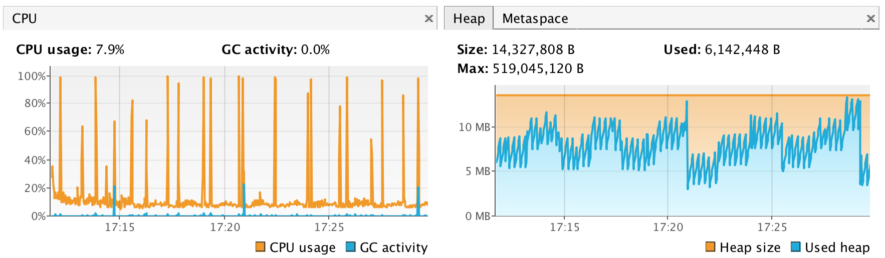

# Temperature Machine ™

A temperature-machine for the Raspberry Pi.

## Quick Start

Build some test data by running the `Example` app from within IntelliJ.

You can then run the monitoring app from the `Main` class. If you want to override the sensor file location (for the case when you're testing without sensors), use `-Dsensor-location=src/test/resources/examples`.

Check the web page with [http://localhost:11900](http://localhost:11900)

It won't display the current temperature unless you have a sensor attached but you'll get some basic graphs displaying.

## Deploying to Your Pi

There's lots of options here but I tend to;

1. Clone the repository on the Pi
2. Run `sbt -J-Xmx512m -J-Xms512m assembly` from a terminal (memory set low for the Pi Zero)
3. Run `./start.sh &` from the checked out folder

## 1-Wire

The `w1-therm` module will output the sensor readings (the contents of the 1-Wire "scratchpad") to a file. For example,

    4b 01 4b 46 7f ff 05 10 d8 : crc=d8 YES
    4b 01 4b 46 7f ff 05 10 d8 t=20687

On the sensor itself, the measurements are stored in an area of memory called the "scratchpad". It's addressed using the following byte table.

Position | Description
--- | ---
Byte 0 | Temperature (least significant byte)
Byte 1 | Temperature (most significant byte)
Byte 2 | TH register on user byte 1 (alarm high)
Byte 3 | TL register on user byte 2 (alarm low)
Byte 4 | Configuration register
Byte 5 | Reserved
Byte 6 | Reserved
Byte 7 | Reserved
Byte 8 | CRC (e.g. `d8` in the example above)

The file format has some additional information as it pulls out the result of the CRC check (`YES`/`NO`) and does the temperature calculation for you. If you're interested, you can calculate the temperature from the bytes yourself by rearranging the first two bytes with least significant at the front;

    01 4b

then treating it as a single hex value, divide by `16`.

    scala> 0x014b / 16.0
    res: Double = 20.6875

## Misc Setup

Make sure any Wifi dongle doesn't fall asleep; famously the Edimax EW-7811UN does. Create a config file for the wifi module with `sudo nano /etc/modprobe.d/8192cu.conf` and add this line

    options 8192cu rtw_power_mgnt=0 rtw_enusbss=0

Check it's running with `lsmod`, you should see something like this

    $ lsmod
    Module                  Size  Used by
    8192cu                569532  0

Setup a `rc.local` file to boot to the thing as the `pi` user;

    $ cat /etc/rc.local
    #!/bin/sh -e
    su pi -c 'cd /home/pi/code/temperature-machine && ./start.sh &'

    exit 0

Connecting to a non-hidden network is straight forward. Setting things up for a hidden network is [a little more involved](http://www.dafinga.net/2013/01/how-to-setup-raspberry-pi-with-hidden.html).

## Pi Stats

Load on the Pi is pretty minimal, however the XML export and graph generation do max out the CPU for short periods.

## References

* [Interesting discussion on the sensor](https://www.raspberrypi.org/forums/viewtopic.php?f=37&t=91982)
* [DS18B20 Datasheet](https://datasheets.maximintegrated.com/en/ds/DS18B20.pdf)
* [Disable power management for the Edimax wifi dongle](https://www.raspberrypi.org/forums/viewtopic.php?t=61665)

